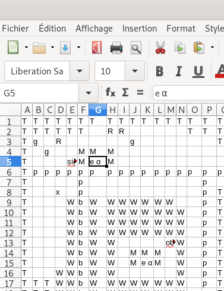
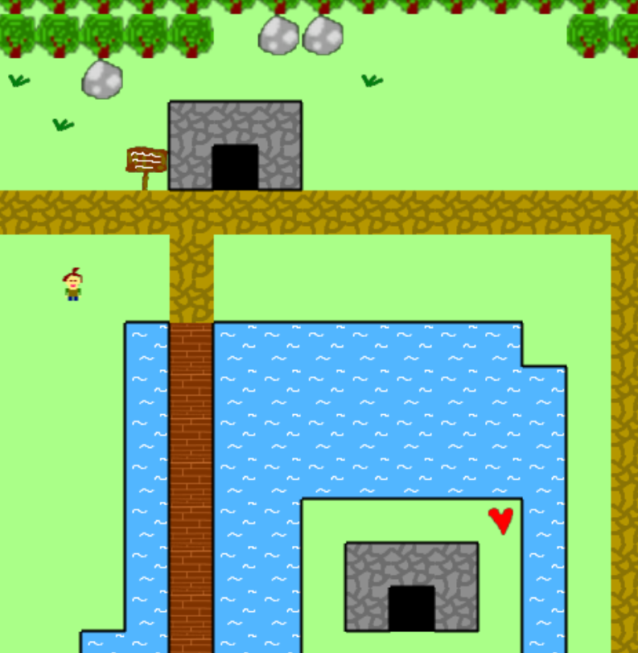

# sea - Spreadsheet engine for adventures

Create your own adventure game with a spreadsheet!

 

## How to use the engine

- Assets are in the corresponding folder
- the map is described in map.csv. Each cell is a tile.
- Use upper case for obstacles.
- Lower case for regular decor.
- Greek letters for passages.
- objXXXX for objects to collect.
- and if needed write some scripts in script.js

